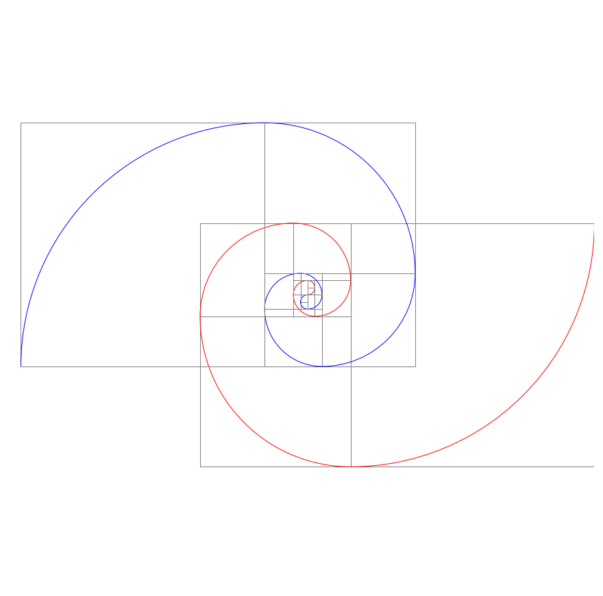
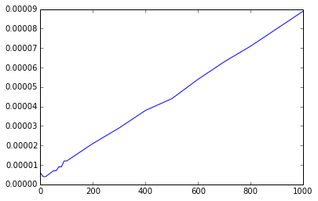
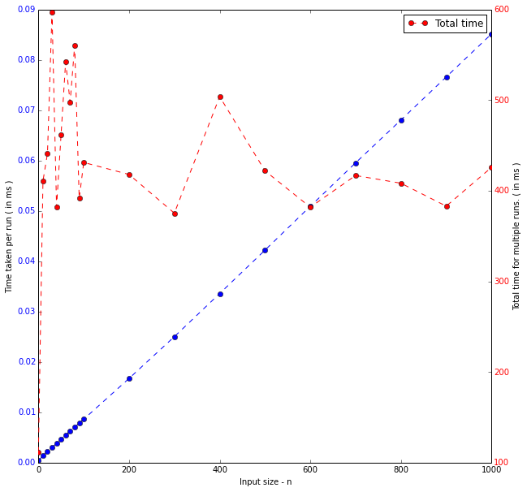

.. code:: python

    # Imports
    import numpy as np # numpy for matrix calculations and randomized vector generation
    from itertools import chain # To flatten lists of list
    # For inline plot of the matplotlib graphs
    %matplotlib inline
    import matplotlib.pyplot as plt
    from matplotlib.patches import Rectangle, Arc # For the fibonacci squares and spiral patches
    from matplotlib.text import Text # For setting the color of y ticks in the last example
CHAPTER 1 - BASIC CONCEPTS
==========================

PROGRAM 1.1, PAGE 17
--------------------

.. code:: python

    # Variable Declaration
    
    n = 50
    f = 20.3
    
    # Printing the variables
    
    print 'n: ', n
    print 'f: ', f

.. parsed-literal::

    n:  50
    f:  20.3

PROGRAM 1.2, PAGE 18
--------------------

.. code:: python

    # Accepting inputs
    
    a = input()
    b = input()
    
    # The input values are stored in a and b

.. parsed-literal::

    6
    5

PROGRAM 1.3, PAGE 19
--------------------

.. code:: python

    # File I/O
    
    try:
        outFile = open('my.out','w')
        n = 50
        f = 20.3
        outFile.write('n: '+str(n)+'\n')
        outFile.write('f: '+str(f)+'\n')
        outFile.close()
        
    # Error handling
    
    except IOError:
        print 'cannot open my.out'
PROGRAM 1.4, PAGE 19
--------------------

.. code:: python

    # An Example of a function
    
    # max returns the maximum of two numbers passed to it 
    # [ Note that we are overriding the default definition for max provided by the language]
    
    def max(a,b):
        if(a>b):
            return a
        else:
            return b
PROGRAM 1.5, PAGE 23
--------------------

.. code:: python

    # Throwing an exception of type str
    
    def div_zero(a,b,c):
        if a<=0 or b<=0 or c<=0 :
            raise Exception('All parameters should be >0')
            # raise an exception when a or b or c = 0
        return a+b*c+b/c
PROGRAM 1.6, PAGE 24
--------------------

.. code:: python

    # Catching an exception.
    
    try:
        print div_zero(2,0,4)
        
    except Exception, e:
        print 'The parameters to DivZero were 2,0,4'
        print 'An exception has been thrown'
        print e

.. parsed-literal::

    The parameters to DivZero were 2,0,4
    An exception has been thrown
    All parameters should be >0

PROGRAM 1.8, PAGE 27
--------------------

.. code:: python

    # Selection Sort
    
    def sel_sort(a,n):
        for i in range(n):
            j = i
            for k in range(i+1,n):
                if(a[k]<a[j]):
                    j = k
            a[i],a[j] = a[j],a[i]
            # a[j] is the smallest no in a[i] to a[n-1]
           
    a = [5,4,3,2,1]
    sel_sort(a,len(a))
    print a

.. parsed-literal::

    [1, 2, 3, 4, 5]

PROGRAM 1.10, PAGE 28
---------------------

.. code:: python

    # Binary search
    # Time complexity - O(log(n))
    
    def binary_search(a,x,n=None):
        """Search the sorted array a[0] to a[n-1] for x"""
        n = len(a) if n is None else n
        left = 0
        right = n-1
        while left <= right:
            # While there are more elements to search
            middle = (left + right)/2
            if x<a[middle]:
                right = middle - 1
            elif x>a[middle]:
                left = middle + 1
            else: 
                return middle
                # Returns index (starting from 0) of the element in the array.
            
        # If not found
        return -1
    
    a = [1,3,4,5,65,7,2234,23,32,342]
    n = len(a)
    x = 65
    
    print binary_search(a,x,n)

.. parsed-literal::

    4

PROGRAM 1.11, PAGE 31
---------------------

.. code:: python

    # Recursive implementation of binary search
    
    def binary_search_rec(a,x,left,right):
        """Search sorted array a[left] ... a[right] for x"""
        if left<=right:
            middle = (left + right)/2
            if x<a[middle]:
                return binary_search_rec(a,x,left,middle-1)
            elif x>a[middle]:
                return binary_search_rec(a,x,middle+1,right)
            else:
                return middle
        # If the value is not found
        else:
            return -1
    
    print binary_search_rec(a,x,0,n-1)

.. parsed-literal::

    4

PROGRAM 1.12, PAGE 32
---------------------

.. code:: python

    # Recursive Permutation generator
    
    def permutations(a,k,m):
        """
        Generate all the  permutations of a[k] ... a[m]
        """
        
        # The result of this if statement is used only internally 
        # ( except when the main ( first / root ) function call parameters k and m are themselves equal )
        if k == m: # For partition size 1
            yield a[:m+1]
            
        else:
            # a[k:m] has more than one permutation. Generate these recursively
            for i in range (k,m+1):
                # Permutation is performed in place, no additional space is used
                a[k],a[i] = a[i],a[k]
                # Perform the sub permutations recursively and combine them together.
                for permuted_item in permutations(a,k+1,m):
                    yield permuted_item
                # Reverting the swap, to perform the next permutation
                a[i],a[k] = a[k],a[i]
    
    a = [1,5,2,6]
    list(permutations(a,0,len(a)-1))

.. parsed-literal::

    [[1, 5, 2, 6],
     [1, 5, 6, 2],
     [1, 2, 5, 6],
     [1, 2, 6, 5],
     [1, 6, 2, 5],
     [1, 6, 5, 2],
     [5, 1, 2, 6],
     [5, 1, 6, 2],
     [5, 2, 1, 6],
     [5, 2, 6, 1],
     [5, 6, 2, 1],
     [5, 6, 1, 2],
     [2, 5, 1, 6],
     [2, 5, 6, 1],
     [2, 1, 5, 6],
     [2, 1, 6, 5],
     [2, 6, 1, 5],
     [2, 6, 5, 1],
     [6, 5, 2, 1],
     [6, 5, 1, 2],
     [6, 2, 5, 1],
     [6, 2, 1, 5],
     [6, 1, 2, 5],
     [6, 1, 5, 2]]

PROGRAM 1.13, PAGE 35
---------------------

.. code:: python

    # Compute the product of the elements a[0:n-1]
    
    import operator
    
    def accumulate(a, start, end, initialValue, op):
        """returns op(sum or product or difference etc ) of values"""
    
        # start -> index of first element of array a
        # end -> index of last element of array a
    
        for e in range(start,end+1):
            initialValue = op(initialValue,a[e])
        return initialValue
    
    # Returns the product of numbers a[0] ... a[n-1]
    def product(a,n):
        initVal = 1
        return accumulate(a,0,n-1,initVal,operator.mul)
PROGRAM 1.14, PAGE 36
---------------------

.. code:: python

    # Permutations using library functions
    
    import itertools
    # contains support for permutations() which is python equivalent of 
    # C++ STL function next_permutation
    
    def print_permutation(string):
        for permutation in itertools.permutations(string):
            print "".join(permutation)
            
    print_permutation("ABCD")

.. parsed-literal::

    ABCD
    ABDC
    ACBD
    ACDB
    ADBC
    ADCB
    BACD
    BADC
    BCAD
    BCDA
    BDAC
    BDCA
    CABD
    CADB
    CBAD
    CBDA
    CDAB
    CDBA
    DABC
    DACB
    DBAC
    DBCA
    DCAB
    DCBA

PROGRAM 1.6, PAGE 38
--------------------

.. code:: python

    # Function to compute a+b+b*c+(a+b-c)/(a+b)+4.0
    
    def abc(a,b,c):
        a = float(a)
        b = float(b)
        c = float(c)
        return a+b+b*c+(a+b-c)/(a+b)+4.0
PROGRAM 1.17, PAGE 39
---------------------

.. code:: python

    # Iterative function for sum
    # NOTE that this overrides the sum function of python
    
    def sum(a,n):
        s = 0
        for i in range(n):
            s += a[i]
        return s
PROGRAM 1.18, PAGE 39
---------------------

.. code:: python

    # Recursive function for sum
    
    def rsum(a,n):
        if n<=0:
            return 0
        else:
            return rsum(a,n-1)+a[n-1]
PROGRAM 1.19, PAGE 44
---------------------

.. code:: python

    # Program 1.17 with count statements added (to compute time complexity)
    # Note that this overrides the default definition of sum in python
    
    count = 0
    def sum(a,n):
        global count
        
        s = 0    
        count += 1
        for i in range(n):
            count += 1    # for loop
            s += a[i]
            count += 1    # for assignment
        count += 1        # for last iteration of for loop
        count += 1        # for return
        return s
    
    count = 0
    sum(np.random.rand(100,1), n = 100)
    print count

.. parsed-literal::

    203

PROGRAM 1.20, PAGE 44
---------------------

.. code:: python

    # Simplified version of Program 1.19
    
    count = 0
    def sum(a,n):
        s =0
        global count
        for i in range(n):
            s += a[i]
            count +=2
        count +=3
        return s
PROGRAM 1.21, PAGE 45
---------------------

.. code:: python

    # Program 1.18 with count statements added
    count = 0
    def rsum(a,n):
        if n<=0:
            global count
            count += 1     # for return
            return 0
        else:
            count += 1     # for return
            return rsum(a,n-1)+a[n-1]
PROGRAM 1.22, PAGE 46
---------------------

.. code:: python

    # Matrix Addition - Without using numpy
    def add(a,b,c,m,n):
        for i in range(m):
            c[i] = [ a[i][j]+b[i][j] for j in range(n)]
            
    a = [[1,2,3],[4,5,6],[7,8,9]]
    b = [[1,2,3],[4,5,6],[7,8,9]]
    c = [[],[],[]]
    add(a,b,c,3,3)
    
    # Displaying the output in latex
    
    matrix_latex = lambda a : r"""
    \mathbf{}
    \begin{bmatrix} 
    %d & %d & %d \\
    %d & %d & %d \\
    %d & %d & %d \\
    \end{bmatrix}"""%tuple(a[0] + a[1] + a[2])
    
    from IPython.display import Math
    
    Math(matrix_latex(a) + " + " + matrix_latex(b) + " = " + matrix_latex(c))

.. math::

    
    \mathbf{}
    \begin{bmatrix} 
    1 & 2 & 3 \\
    4 & 5 & 6 \\
    7 & 8 & 9 \\
    \end{bmatrix} + 
    \mathbf{}
    \begin{bmatrix} 
    1 & 2 & 3 \\
    4 & 5 & 6 \\
    7 & 8 & 9 \\
    \end{bmatrix} = 
    \mathbf{}
    \begin{bmatrix} 
    2 & 4 & 6 \\
    8 & 10 & 12 \\
    14 & 16 & 18 \\
    \end{bmatrix}

PROGRAM 1.23, PAGE 47
---------------------

.. code:: python

    # Matrix addition with counting statements
    
    def matrix_add(a,b,c,m,n):
        count = 1
        #for for loop i
        for i in range(m):
            count += 1    #for for loop j
            s = [a[i,j]+b[i,j] for j in range(n)]
            c[i] = s
            count += 1    # for assignment
            count += 1    # for last time for j
        count += 1 # for last time for i    
        return count
PROGRAM 1.24, PAGE 47
---------------------

.. code:: python

    # Simplified program with counting only
    
    def matrix_add_count_only(m,n):
        count = 0
        for i in range(m):
            for j in range(n):
                count += 2
            count += 2
        count += 1
        return count
        
    matrix_add_count_only(5,5)

.. parsed-literal::

    61

PROGRAM 1.25, PAGE 50
---------------------

.. code:: python

    # Fibonacci Number
    def fibonacci(n):
        """
        Compute the Fibonacci number Fn for the given n.
        Refer : http://en.wikipedia.org/wiki/Fibonacci_number
        """
        # F0 = 0 F1 = 1
        if n < 2:
            return n
        else:
            # Recursively define the fibonacci series
             return fibonacci(n-1) + fibonacci(n-2)
            
    for i in range(20):
        print fibonacci(i),

.. parsed-literal::

    0 1 1 2 3 5 8 13 21 34 55 89 144 233 377 610 987 1597 2584 4181

.. code:: python

    # NOT IN TEXTBOOK
    # Fibonacci spiral
    # NOTE : Requires matplotlib installed
    
    fig, ax = plt.subplots(); patches = []
    
    fig.set_size_inches(15,15)
    #fig.set_facecolor('#C39630')     #C39630 - Golden brown color in Hex format
    
    def fib_squares_and_spiral(n, square_color = "grey", spiral_color = "brown", clockwise = True, square = True, spiral = True, offset_angle = 0):
        """
        Generate matplotlib.patches.Rectange object for all fibonacci squares 
        ( spirally placed ) upto the nth square
        """
        
        if not ( square or spiral ):
            raise Exception("Both square and spiral cannot be set to False")
        
        direction = 1 if clockwise else -1
        
        # Initialization for square 
        # =========================
        
        # Changes in sign in the del x, del y for the 4 basic incremental steps for the
        # x, y coordinates of the square's diagonal
        signs_del_x = [ 1, 1, -1, -1 ]    
        signs_del_y = [ -1, 1, 1, -1 ]
        
        # Initalizing the coordinates of the diagonals for the square of 1x1
        d1_x, d1_y     =  0,  0
        del_x, del_y   =  0,  0
        
        # Initialization for the arc
        # ==========================
        
        # The changes in coordinates of the center for the 4 basic incremental steps
        changes_cx = [ 0, 1, 0, -1 ]
        changes_cy = [ -1, 0, 1, 0 ]
        # These lists are called changes instead of signs to emphasize the fact that 
        # while the coordinates of the dimensions of the square's diagonals change in both x and y
        # for every step, the center of the arc changes only by one coordinate every step
        # NOTE: This is also true for the center of square, which can also be used to plot the 
        # squares in a different method.
        
        # Initializing the coordinates of the center of arc
        center_x, center_y = 0, direction
        
        # i refers to the ith square of dimenstions { f(i) X f(i) } ( or ) the ith arc of radius f(i)
        
        for i in range(1, n+1):
            
            f_i = fibonacci(i)   # i-th fibonacci number
            step_no = i%4        # index of the sign vector
            
            # print  f_i, "step=", step_no, "dir", direction, "arc :", center_x, center_y
            
            if square:
                # Compute the difference in the coordinates of the extremes of the square's diagonal
            
                # Other end is computed based on the fibonacci number and the sign vector
                del_x = signs_del_x[step_no] * direction * f_i
                del_y = signs_del_y[step_no] * direction * f_i
    
                # Square Patch
                # Rectangle whose one diagonal is { (d1_x, d1_y), (d1_x + del_x, d1_y + del_y) }
                square_patch = Rectangle([d1_x,d1_y], 
                                         width = del_x,
                                         height = del_y,
                                         facecolor = 'none',
                                         edgecolor = square_color,
                                         )
                
                # The end point of the diagonal of the old square is the starting point of the diagonal for the new square
                d1_x, d1_y = d1_x + del_x, d1_y + del_y
                
            if spiral:
                # 
                
                # Arc patch generation
                
                # The axis width and height is twice the i-th fibonacci number
                # Rotation angle is incremented by 90° every successive step
                arc_patch = Arc(xy = [center_x, center_y],
                                width = 2 * fibonacci(i),
                                height = 2 * fibonacci(i),
                                theta1 = 0,
                                theta2 = 90,
                                angle = 90 * i - int(clockwise)*180 - direction * offset_angle,
                                edgecolor = spiral_color
                                )
                
                # The new center is computed from the increment changes vector and fibonacci of the (i-2)nd term
                center_x, center_y = center_x - direction * changes_cx[step_no] * fibonacci(i-1), center_y - direction * changes_cy[step_no] * fibonacci(i-1)
    
            if square and spiral:
                yield ( square_patch, arc_patch )
                
            elif square:
                yield ( square_patch, )
                
            else:
                yield ( arc_patch, )
                        
    
    # Chain together all the ( square_patch, arc_patch ) tuples into one long list and 
    # apply the `ax.add_patch` on every item of the list containing the flattened list of all
    # the Rectangle patch objects and the Arc patch objects to add them to the axes object ( ax )
    
    # One clockwise spiral
    map(ax.add_patch, chain.from_iterable(fib_squares_and_spiral(9, clockwise = True, spiral_color = "Red")))
    # One Anticlockwise spiral
    map(ax.add_patch, chain.from_iterable(fib_squares_and_spiral(9, clockwise = False, spiral_color = "blue")))
    
    plt.axis('equal');
    plt.axis('off');
    plt.show();

PROGRAM 1.26, PAGE 58
---------------------

.. code:: python

    # Magic Square
    
    def magic_square(n):
        '''Return a magic square of size n, n is odd'''
        max_size = 51
        
        # Check if n is within range
        if ( n > max_size ) or ( n < 1 ):
            raise Exception('Error!..n out of range')
        elif (n%2) == 0:
            raise Exception('Error!..n is even')
        
        # n is odd hence Coxeter's rule can be applied
        square = np.zeros((n,n))
        
        square[0][(n-1)/2] = 1
        # Start with middle row of 1st element
                
        # i and j are current positions
        key = 2
        i = 0
        j = (n-1)/2
        nsquared = n*n
            
        while key <= nsquared:
            # Move up and left
            k = (n-1) if (i-1)<0 else (i-1) # Wrap around, if the corners are reached
            l = (n-1) if (j-1)<0 else (j-1) # Wrap around, if the corners are reached
            
            if square[k][l] != 0 :    
                # if square occupied, move down
                i = (i+1)%n
            else:
                # if Square is unoccupied
                i = k
                j = l
                
            square[i][j] = key
            key +=  1
            
        return square
    
    print 'magic square of size 5'
    print magic_square(5)

.. parsed-literal::

    magic square of size 5
    [[ 15.   8.   1.  24.  17.]
     [ 16.  14.   7.   5.  23.]
     [ 22.  20.  13.   6.   4.]
     [  3.  21.  19.  12.  10.]
     [  9.   2.  25.  18.  11.]]

PROGRAM 1.27, PAGE 62
---------------------

.. code:: python

    # Sequental Search - Time Complexity : O(n)
    i = 0
    def sequential_search(a,n,x):
        global i
        for i in range(n):
            if(a[i] == x):
                break
        if(i==n):
            return -1
        else:
            return i
    
    a = [1,3,4,5,65,7,2234,23,32,342]
    print sequential_search(a,len(a),32)

.. parsed-literal::

    8

PROGRAM 1.28, PAGE 63
---------------------

.. code:: python

    # Program to time Program 1.27
    
    # For getting the current processor time
    import time as t
    
    def time_search():                
        a = range(1,1001)
        n = [10*j for j in range(10)] + [100*j+100 for j in range(10)]
        for j in range(20):
            # Obtain Computing times
            start = t.clock()                      #Start timer
            k = sequential_search(a,n[j],0)   #Unsuccessfull search
            stop = t.clock()                       #Stop timer
            run_time = (stop - start)
            yield  ( n[j], run_time )
        
    x_axis = list(); y_axis = list()
    
    print 'n \ttime'
    print '==========================='
    for data in time_search():
        print data[0],"\t",data[1]
        x_axis.append(data[0]); y_axis.append(data[1])
    print 'Times are in hundredths of a second'

.. parsed-literal::

    n 	time
    ===========================
    0 	5.99999999906e-06
    10 	3.99999999701e-06
    20 	5.00000000159e-06
    30 	5.99999999906e-06
    40 	5.99999999906e-06
    50 	7.00000000364e-06
    60 	8.00000000112e-06
    70 	8.99999999859e-06
    80 	1.00000000032e-05
    90 	9.99999999607e-06
    100 	9.99999999607e-06
    200 	2.00000000063e-05
    300 	3.00000000024e-05
    400 	3.89999999939e-05
    500 	5.50000000032e-05
    600 	5.90000000003e-05
    700 	6.59999999968e-05
    800 	7.50000000025e-05
    900 	8.30000000036e-05
    1000 	9.90000000058e-05
    Times are in hundredths of a second

.. code:: python

    # Plotting the graph : 
    
    plt.figure().set_size_inches(10,10)
    plt.plot(x_axis, y_axis, marker = "o", linestyle = "--")
    plt.xlabel("Size of input : n")
    plt.ylabel("Time taken for Sequential search in ms")
    plt.show()

PROGRAM 1.29, PAGE 65
---------------------

.. code:: python

    # Timing Program - (Using repetitive testing)
    
    # For getting the current processor time
    import time as t
    
    def time_search():                
        a = range(1,1001)
        n = [10*j for j in range(10)] + [100*j+100 for j in range(10)]
        r = [300000,300000,200000,200000,100000,100000,100000,80000,80000]
        r += [50000,50000,25000,15000,15000,10000,7500,7000,6000,5000,5000]
        
        for j in range(20):
            # Obtain Computing times
            start = t.clock()                      # Start timer
            for b in range (r[j]+1):
                k = sequential_search(a,n[j],0)    # Unsuccessfull search
            stop = t.clock()                       # Stop timer
            total_time = (stop - start)*1000
            run_time = float(total_time)/float(r[j])
            yield (n[j], total_time, run_time)
    
    del x_axis[:] # Clearing out all the elements of the old x_axis and y_axis list
    del y_axis[:]
    
    y_axis1 = y_axis # Reusing the old list for y_axis1
    y_axis2 = list()
    
    print 'n \tTotal Time \tRun Time'
    print "==========================================="
    
    for data in time_search():
        print data[0], "\t", data[1], "\t", data[2]
        x_axis.append(data[0])
        y_axis1.append(data[1])
        y_axis2.append(data[2])
    
    print '\nAll times are in milli second'

.. parsed-literal::

    n 	Total Time 	Run Time
    ===========================================
    0 	111.847 	0.000372823333333
    10 	410.765 	0.00136921666667
    20 	441.377 	0.002206885
    30 	597.294 	0.00298647
    40 	382.142 	0.00382142
    50 	462.241 	0.00462241
    60 	542.372 	0.00542372
    70 	497.854 	0.006223175
    80 	560.549 	0.0070068625
    90 	391.517 	0.00783034
    100 	431.272 	0.00862544
    200 	418.013 	0.01672052
    300 	375.314 	0.0250209333333
    400 	503.893 	0.0335928666667
    500 	422.067 	0.0422067
    600 	381.923 	0.0509230666667
    700 	416.878 	0.059554
    800 	408.363 	0.0680605
    900 	383.069 	0.0766138
    1000 	425.869 	0.0851738
    
    All times are in milli second

.. code:: python

    fig, ax1 = plt.subplots()
    
    fig.set_size_inches(10,10)
    
    ax1.plot(x_axis, y_axis2, c = "b", marker = "o", linestyle = "--")
    ax1.set_xlabel("Input size - n")
    ax1.set_ylabel("Time taken per run ( in ms )")
    
    # Apply the Text_object.set_color method on all the tick labels with 'r' as a parameter
    map(Text.set_color, ax1.get_yticklabels(), ['b']*len(ax1.get_yticklabels()) )
    
    ax2 = ax1.twinx()
    ax2.plot(x_axis, y_axis1, c = "r", marker = "o", linestyle = "--", label = "Total time")
    ax2.set_ylabel("Total time for multiple runs. ( in ms )")
    
    map(Text.set_color, ax2.get_yticklabels(), ['r']*len(ax2.get_yticklabels()) )
    
    plt.legend()
    plt.show()

