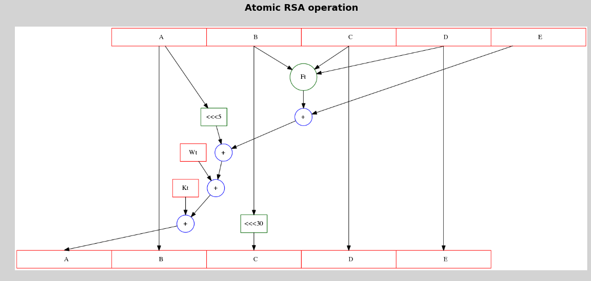
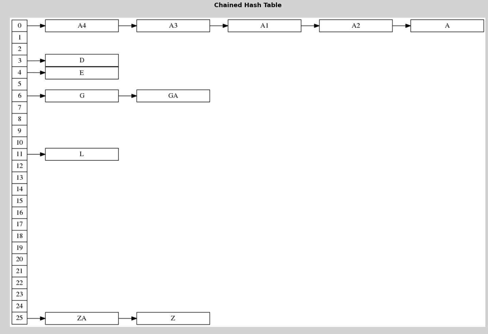

EXAMPLE 8.1, PAGE 459
---------------------

.. code:: python

    # Hash table with 2 Buckets
    
    b = 26 # No of buckets
    s = 2  # No of slots
    n = 10 # No of keys
    
    a = round(n / float( b*s ), 2) # a is α, the loading factor
    print unichr(0x3b1).encode('utf-8'), "=", a

.. parsed-literal::

    α = 0.19

.. code:: python

    # Defining the hash function.
    
    def h(K):
        """Returns the alphabetical order of the String based on its first character"""
        return ord(K[0].upper()) - 65
    
    # Testing the hash function
    
    print h('book'), h('apple')

.. parsed-literal::

    1 0

.. code:: python

    # Constructing the hash table
    
    hash_table = { i: [] for i in range(26) }
.. code:: python

    # defining the hash_table populating function
    
    def build_hash(hash_table, value):
        key = h(value)
        
        # Raise an exception if hash table overflow occurs
        if len(hash_table[key]) == 2:
            raise Exception("Hashtable overflow.")
            
        hash_table[key].append(value)
    
    # hash_table clearing function
        
    def clear_hash_table(hash_table):
        """ Clears all the entries in each key of the hashtable """
        for key in hash_table:
            del hash_table[key][:]
            
    # hash_table printing function
    
    
    def print_hash_table(hash_table):
        for key in hash_table:
            print key, "\t", hash_table[key]
.. code:: python

    print_hash_table(hash_table)

.. parsed-literal::

    0 	[]
    1 	[]
    2 	[]
    3 	[]
    4 	[]
    5 	[]
    6 	[]
    7 	[]
    8 	[]
    9 	[]
    10 	[]
    11 	[]
    12 	[]
    13 	[]
    14 	[]
    15 	[]
    16 	[]
    17 	[]
    18 	[]
    19 	[]
    20 	[]
    21 	[]
    22 	[]
    23 	[]
    24 	[]
    25 	[]

.. code:: python

    # Non-overflow condition
    list_of_inputs = ['GA', 'D', 'A', 'G', 'L', 'A2', 'E']
    for item in list_of_inputs:
        build_hash(hash_table, item)
        
    print_hash_table(hash_table)

.. parsed-literal::

    0 	['A', 'A2']
    1 	[]
    2 	[]
    3 	['D']
    4 	['E']
    5 	[]
    6 	['GA', 'G']
    7 	[]
    8 	[]
    9 	[]
    10 	[]
    11 	['L']
    12 	[]
    13 	[]
    14 	[]
    15 	[]
    16 	[]
    17 	[]
    18 	[]
    19 	[]
    20 	[]
    21 	[]
    22 	[]
    23 	[]
    24 	[]
    25 	[]

.. code:: python

    # Clearing the old hash table
    
    clear_hash_table(hash_table)
.. code:: python

    # Overflow condition
    list_of_inputs = ['GA', 'D', 'A', 'G', 'L', 'A2', 'A1', 'A3', 'A4', 'E']
    for item in list_of_inputs:
        print "Attempting to add item, '%s', to hash_table\n"%item
        print "Computed hash value :", h(item)
        build_hash(hash_table, item)
        print "Successfuly added to hash table\n"

.. parsed-literal::

    Attempting to add item, 'GA', to hash_table
    
    Computed hash value : 6
    Successfuly added to hash table
    
    Attempting to add item, 'D', to hash_table
    
    Computed hash value : 3
    Successfuly added to hash table
    
    Attempting to add item, 'A', to hash_table
    
    Computed hash value : 0
    Successfuly added to hash table
    
    Attempting to add item, 'G', to hash_table
    
    Computed hash value : 6
    Successfuly added to hash table
    
    Attempting to add item, 'L', to hash_table
    
    Computed hash value : 11
    Successfuly added to hash table
    
    Attempting to add item, 'A2', to hash_table
    
    Computed hash value : 0
    Successfuly added to hash table
    
    Attempting to add item, 'A1', to hash_table
    
    Computed hash value : 0

::

    ---------------------------------------------------------------------------
    Exception                                 Traceback (most recent call last)

    <ipython-input-8-b5788229e327> in <module>()
          4     print "Attempting to add item, '%s', to hash_table\n"%item
          5     print "Computed hash value :", h(item)
    ----> 6     build_hash(hash_table, item)
          7     print "Successfuly added to hash table\n"

    <ipython-input-4-d767746eba40> in build_hash(hash_table, value)
          6     # Raise an exception if hash table overflow occurs
          7     if len(hash_table[key]) == 2:
    ----> 8         raise Exception("Hashtable overflow.")
          9 
         10     hash_table[key].append(value)

    Exception: Hashtable overflow.

.. code:: python

    print_hash_table(hash_table)

.. parsed-literal::

    0 	['A', 'A2']
    1 	[]
    2 	[]
    3 	['D']
    4 	[]
    5 	[]
    6 	['GA', 'G']
    7 	[]
    8 	[]
    9 	[]
    10 	[]
    11 	['L']
    12 	[]
    13 	[]
    14 	[]
    15 	[]
    16 	[]
    17 	[]
    18 	[]
    19 	[]
    20 	[]
    21 	[]
    22 	[]
    23 	[]
    24 	[]
    25 	[]

EXAMPLE 8.2, PAGE 463
---------------------

.. code:: python

    # Computing the hash using the shift folding method.
    
    from math import ceil
    
    def shift_folding_hash(value, p = 3):
        """ Compute the hash using shift folding method of partition size p = 3 """
        
        str_value = str(value)
        length = len(str_value)
        
        # Partitioning funciton
        def P(i):
            print str_value[(p*int(i)):(p*int(i)+p)], 
            return int(str_value[(p*int(i)):(p*int(i)+p)])
        
        hash_value = 0
        hash_length = int(ceil(length / float(p)))
        
        for i in range(0, hash_length):
            hash_value += P(i)
        
        return hash_value
        
    shift_folding_hash(12320324111220)

.. parsed-literal::

    123 203 241 112 20

.. parsed-literal::

    699

.. parsed-literal::

    

PROGRAM 8.1, PAGE 464
---------------------

.. code:: python

    # Converting a string into a non-negative integer
    
    def StringToInt(s):
        """ Convert the string to a non negative integer hash value """
        length = len(s)
        hash_value = 0
        
        if length % 2:
            # Length is odd 
            hash_value = ord(s[-1])
            length -= 1
            
        for i in range(0, length, 2):
            # Process 2 characters at a time
            hash_value += ord(s[i])
            hash_value += ord(s[i+1]) << 8
            
        return hash_value
    
    # Example usage of StringToInt [ Not in text book ]
    
    print StringToInt("A Sample Text")

.. parsed-literal::

    140390

.. code:: python

    print StringToInt("Another Sample Text")

.. parsed-literal::

    224431

PROGRAM 8.2, PAGE 465
---------------------

.. code:: python

    # The specialization hash 
    
    # Python has inbuild hash function like the hash<String> class of C++ STL
    
    hash

.. parsed-literal::

    <function hash>

.. code:: python

    # Documentation of the hash
    
    print hash.__doc__

.. parsed-literal::

    hash(object) -> integer
    
    Return a hash value for the object.  Two objects with the same value have
    the same hash value.  The reverse is not necessarily true, but likely.

.. code:: python

    hash("Some Random Text")

.. parsed-literal::

    6088784263229587202

.. code:: python

    hash("Another Random Text")

.. parsed-literal::

    3144334941465197392

PROGRAM 8.3, PAGE 466
---------------------

.. code:: python

    # SHA Algorithm
    
    # Computing the SHA-1 digest using inbuild hashlib library
    import hashlib
    print hashlib.sha1('67452301efcdab8998badcfe10325476c3d2e1f').hexdigest()

.. parsed-literal::

    aee7ec00bda87b68d0a55c34798fa932a3b82363

FIGURE 8.2, PAGE 467
--------------------

.. code:: python

    # Atomic RSA Operation
    
    import pygraphviz as pgv
    %pylab inline
    
    RSA_1_FlowChart_DOT_FORMAT = """
    digraph g {
    
    overlap = true
    
    node [shape = record, color = "lightblue"];
    nodeS[label = "<f0>\t\t\tA\t\t\t|<f1>\t\t\tB\t\t\t|<f2>\t\t\tC\t\t\t|<f3>\t\t\tD\t\t\t|<f4>\t\t\tE\t\t\t", color="red"];
    node1[label = "<f0> \<\<\<5", color="darkgreen"];
    node2[label = "<f0> \<\<\<30", color="darkgreen"];
    nodeE[label = "<f0>\t\t\tA\t\t\t|<f1>\t\t\tB\t\t\t|<f2>\t\t\tC\t\t\t|<f3>\t\t\tD\t\t\t|<f4>\t\t\tE\t\t\t", color="red"];
    node3[label = "Wt", color="red"]
    node4[label = "Kt", color="red"]
    
    adder0[shape = circle, label="+", color="blue"];
    adder1[shape = circle, label="+", color="blue"];
    adder2[shape = circle, label="+", color="blue"];
    adder3[shape = circle, label="+", color="blue"];
    
    function[shape = circle, label="\ \ Ft\ \ ", color="darkgreen"];
    
    nodeS:f0 -> node1;
    node1    -> adder1;
    
    nodeS:f1 -> node2;
    node2    -> nodeE:f2;
    
    nodeS:f2 -> nodeE:f3;
    nodeS:f3 -> nodeE:f4
    
    nodeS:f4 -> adder0
    adder0     -> adder1
    adder1     -> adder2
    adder2     -> adder3
    adder3     -> nodeE:f0
    
    node3      -> adder2
    node4      -> adder3
    
    nodeS:f1   -> function
    nodeS:f2   -> function
    nodeS:f3   -> function
    
    function   -> adder0
    
    nodeS:f0   -> nodeE:f1
    
    }
    """
    
    RSA = pgv.AGraph(string = RSA_1_FlowChart_DOT_FORMAT)
    RSA.layout(prog="dot", args= "-Gsplines=false  -Goverlap=scale" )
    RSA.draw('RSA-1_Flow_Chart.png')
    figure(figsize=(20, 20), facecolor='lightgrey', edgecolor='b')
    axis('off')
    title("Atomic RSA operation\n\n\n", fontdict = { 'fontsize' : 18, 'fontweight':'bold', 'verticalalignment' : 'center', 'horizontalalignment' : 'center' } )
    imshow(imread('RSA-1_Flow_Chart.png'))
    
    print "\n"

.. parsed-literal::

    Populating the interactive namespace from numpy and matplotlib
    
    

.. parsed-literal::

    WARNING: pylab import has clobbered these variables: ['ceil']
    `%matplotlib` prevents importing * from pylab and numpy

EXAMPLE 8.6, PAGE 468
---------------------

.. code:: python

    # Hash Table with Linear Probing
    
    # Modifying the earlier build hash function to handle overflow and add both key and value.
    
    def build_hash(hash_table, key, value = None):
        orig_key = k = h(key)
        
        overflow = False
        
        while(len(hash_table[k]) != 0):
            k = (k + 1) % len(hash_table)
            if k == orig_key :
                overflow = True
                break
        
        # Raise a Hashtable overflow exception only if the entire hash table ( for all keys ) is full.
        if overflow:
            raise Exception("Hashtable overflow.")
        
        hash_table[k].append((key, value))
FIGURE 8.3, PAGE 469
--------------------

.. code:: python

    # Testing the new hash table
    hash_table = { i: [] for i in range(26) }
    
    list_of_inputs = ['GA', 'D', 'A', 'G', 'L', 'A2', 'A1', 'A3', 'A4', 'Z', 'ZA', 'E']
    
    for item in list_of_inputs:
        build_hash(hash_table, item)
    
    print_hash_table(hash_table)

.. parsed-literal::

    0 	[('A', None)]
    1 	[('A2', None)]
    2 	[('A1', None)]
    3 	[('D', None)]
    4 	[('A3', None)]
    5 	[('A4', None)]
    6 	[('GA', None)]
    7 	[('G', None)]
    8 	[('ZA', None)]
    9 	[('E', None)]
    10 	[]
    11 	[('L', None)]
    12 	[]
    13 	[]
    14 	[]
    15 	[]
    16 	[]
    17 	[]
    18 	[]
    19 	[]
    20 	[]
    21 	[]
    22 	[]
    23 	[]
    24 	[]
    25 	[('Z', None)]

PROGRAM 8.4, PAGE 470
---------------------

.. code:: python

    # Linear probing
    
    list_of_values = ['234333', '23423', 'foo', 'bar', 'abcd', 'sometext', 'another text', 'nine', 'ten', 'another value', 'final value']
    
    # Clearing the hash table.
    hash_table = { i: [] for i in range(26) }
    
    # Building the hash with key value pair
    for item, val in zip(list_of_inputs, list_of_values):
        build_hash(hash_table, item, val)
    
    # define get_value function to return the hash, key pair in the given hash_table using linear probing technique
    
    def get_value(hash_table, key):
        i = h(key)  # Home bucket
        
        # Linearly probe the hash_table one by one
        
        if hash_table[i][0][0] == key:
            return hash_table[i][0]
        
        j = ( i + 1 ) % len(hash_table)
        while j != i:
            if hash_table[j][0][0] == key:
                return hash_table[j][0]
            
            j = ( j + 1 ) % len(hash_table)
            
        return None
    
    print get_value(hash_table, 'GA')

.. parsed-literal::

    ('GA', '234333')

SECTION 8.2.4.2, PAGE 471
-------------------------

.. code:: python

    # Chaining based hashing.
    
    class Node:
        def __init__(self, data, link = None):
            self.data = data
            self.link = link
            
    class KVPair:
        """ Class to store a key and value pair as a single object """
        def __init__(self, key, value):
            self.key = key
            self.value = value
        
        def __repr__(self):
            return str(self.key) + " " + str(self.value)
        
        __str__ = __repr__
            
    class Chained_Hash_Table:
        def __init__(self):
            self.hash_table = { i: None for i in range(26) }
            
        def __repr__(self):
            """Returns the dot representation of the hash table and associated chains"""
            # Basic template
            base_template = "digraph G {\n nodesep = 0;\n rankdir=LR;\n\n            node [shape=record,width=.1,height=.1];\n"
            hash_table_strip = '            nodeH [label = "<f0> 0' + "".join(["|<f%s> %d"%(str(i),i) for i in range(1,26)]) + '", height=3];\n'
            chain_base_data = "            node [width = 2];\n"
            
            # Chain data templates
            node_data  = '            node{node_no} [label = "{node_value}"];\n'
            primary_link   = '            nodeH:f{key} -> node{node_no};\n'
            secondary_link = '            node{nodea} -> node{nodeb};\n'
            
            final_dot = ""
            
            final_dot += base_template + hash_table_strip + "\n" + chain_base_data
            
            nodes = 0
            
            for key, value in self.hash_table.iteritems():
                first_node = True
                
                # Construct the chain for each key of the hash table.
                while value is not None:
                    final_dot += node_data.format(node_no=nodes, node_value=value.data.key)
                    
                    if first_node:
                        final_dot += primary_link.format(key=key, node_no=nodes)
                        first_node = False
                        
                    else:
                        final_dot += secondary_link.format(nodea=nodes-1, nodeb=nodes)
                    
                    nodes += 1
                    value = value.link
            
            final_dot += "\n\n}"
            
            return final_dot
        
        __str__ = __repr__
        
        def add(self, key, value):
            """Add an entry to the hash table"""
            
            k = h(key)
            
            temp_node = self.hash_table[k]
            self.hash_table[k] = Node(KVPair(key, value), temp_node)
            
        def display(self):
            RSA = pgv.AGraph(string = repr(self))
            RSA.layout(prog="dot", args= "-Gsplines=false  -Goverlap=scale" )
            RSA.draw('ChainedHashTable.png')
            figure(figsize=(25, 25), facecolor='lightgrey', edgecolor='b')
            axis('off')
            title("Chained Hash Table\n\n\n", fontdict = { 'fontsize' : 18, 'fontweight':'bold', 'verticalalignment' : 'center', 'horizontalalignment' : 'center' } )
            imshow(imread('ChainedHashTable.png'))
            
            
    hash_table = Chained_Hash_Table()
    
    list_of_inputs = ['GA', 'D', 'A', 'G', 'L', 'A2', 'A1', 'A3', 'A4', 'Z', 'ZA', 'E']
    list_of_values = ['234333', '23423', 'foo', 'bar', 'abcd', 'sometext', 'another text', 'nine', 'ten', 'another value', 'final value', 'abc']
    
    for key, value in zip(list_of_inputs, list_of_values):
        hash_table.add(key, value)
    
    # Print the dot representation of the chained hash_table
    print "The dot representation of the chained hash table:"
    print "=================================================\n\n"
    print repr(hash_table)
    
    hash_table.display()

.. parsed-literal::

    The dot representation of the chained hash table:
    =================================================
    
    
    digraph G {
     nodesep = 0;
     rankdir=LR;
    
                node [shape=record,width=.1,height=.1];
                nodeH [label = "<f0> 0|<f1> 1|<f2> 2|<f3> 3|<f4> 4|<f5> 5|<f6> 6|<f7> 7|<f8> 8|<f9> 9|<f10> 10|<f11> 11|<f12> 12|<f13> 13|<f14> 14|<f15> 15|<f16> 16|<f17> 17|<f18> 18|<f19> 19|<f20> 20|<f21> 21|<f22> 22|<f23> 23|<f24> 24|<f25> 25", height=3];
    
                node [width = 2];
                node0 [label = "A4"];
                nodeH:f0 -> node0;
                node1 [label = "A3"];
                node0 -> node1;
                node2 [label = "A1"];
                node1 -> node2;
                node3 [label = "A2"];
                node2 -> node3;
                node4 [label = "A"];
                node3 -> node4;
                node5 [label = "D"];
                nodeH:f3 -> node5;
                node6 [label = "E"];
                nodeH:f4 -> node6;
                node7 [label = "G"];
                nodeH:f6 -> node7;
                node8 [label = "GA"];
                node7 -> node8;
                node9 [label = "L"];
                nodeH:f11 -> node9;
                node10 [label = "ZA"];
                nodeH:f25 -> node10;
                node11 [label = "Z"];
                node10 -> node11;
    
    
    }

PROGRAM 8.5, PAGE 471
---------------------

.. code:: python

    # Chain search
    
    def _get(self, key):
        """ Search the chained hash table for key k """
        k = h(key) # Get the repective bucket number
        current = self.hash_table[k]
        
        # Search through the chain
        while current is not None and current.data.key != key:
            current = current.link
            
        return current
    
    Chained_Hash_Table.get = _get
.. code:: python

    # Example to illustrate the get operation
    
    print hash_table.get("A4").data

.. parsed-literal::

    A4 ten

